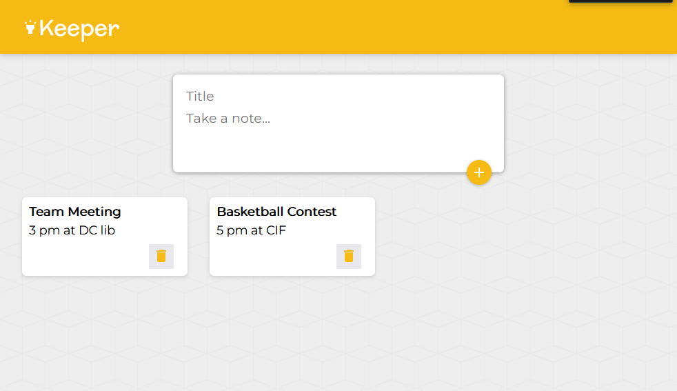

# Google-Keep-Clone

Developed a Google Keep clone using JavaScript and React.js, designed to replicate the core functionalities of the original application. The project enabled users to create, delete, and edit notes, providing an intuitive and efficient note-taking experience. The user interface was meticulously crafted to closely mirror Google Keep, ensuring a familiar and seamless user experience.
